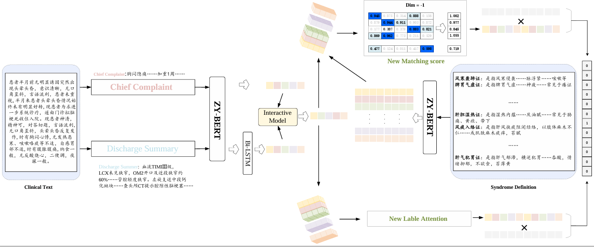

# CCSD (TCM Syndrome Differentiation)

This is our Pytorch implementation for the paper:

> Zhizhuo Zhao, Xueping Peng, Yong Li, Hao Wu, Weiyu Zhang, Wenpeng Lu (2024). Thinking the Importance of Patient’s Chief Complaint in TCM Syndrome Differentiation. In CSCWD 2024, Tianjin, China, May 8-10, 2024.



## Introduction

This paper focuses on the task of TCM syndrome differentiation, proposing a novel matching score calculation method and a new label attention calculation method to assist the model in focusing on the relationship between TCM syndrome and disease symptom.

Specifically, we enhance the model's attention to the uniqueness of the relationship between TCM syndrome and symptom by introducing a finer-grained token-level matching score. Simultaneously, we improve the model's attention to the generality of the relationship between TCM syndrome and symptom through a more global label attention mechanism. Additionally, we observe a severe long-tail problem in the dataset. To alleviate this issue, we propose the use of focal loss to help the model pay more attention to challenging samples. 

## Requirements:

- Python=3.8
- Pytorch = 1.13.0

## Dataset and ZY-BERT

**TCM-SD Dataset**

- Install the TCM-SD dataset following this ([TCM-SD: A Benchmark for Probing Syndrome Differentiation via Natural Language Processing]([Borororo/ZY-BERT (github.com)](https://github.com/Borororo/ZY-BERT))).
- **TCM_SD_with_knowledge** Contains the full data! You can find more details about the dataset at ([here](https://tianchi.aliyun.com/dataset/dataDetail?dataId=139034)).
- Place the TCM-SD file to `./data_preprocess/`. Include 3 files (train.json , dev.json , test.json).

**ZY-BERT**

- Pre-trained ZY-BERT could be downloaded at [here](https://drive.google.com/file/d/1fC9geqeLk5YK9y_O-UjfIKtLeu0Iie8j/view?usp=sharing).

**Pretrained syndrome embeddings**

- When the program is run for the first time, the program will automatically find the corresponding external knowledge text (`./data_preprocess/syndrome_knowledge.json`) for each syndrome type and use the frozen ZY-BERT for encoding. Finally, the vector corresponding to the certificate type text is stored in `./def_vec/`.

## How to run

Now that there are 3 files in data_preprocess folder. There are common hyperparameters for the CCSD model. See `./train_parser.py` for more detail. When `./def_vec` is not null, you can run this code.

Here is an example of using the framework on TCM-SD dataset to run the code

```
python main.py\
	--batch_size 2 \
	--epochs 10 \
	--model_path ./bert-base-uncased \
	--d_a 256 \
	--n_labels 148 \
```


## Acknowledgement

Any scientific publications that use our codes and datasets should cite the following paper as the reference:

```
  @inproceedings{ijcai2020-461-vu,
      title     = {A Label Attention Model for ICD Coding from Clinical Text},
      author    = {Vu, Thanh and Nguyen, Dat Quoc and Nguyen, Anthony},
      booktitle = {Proceedings of the 27th International Conference on Computer Supported Cooperative Work in Design, {CSCWD 2024}},             
      year      = {2024},
   }
```